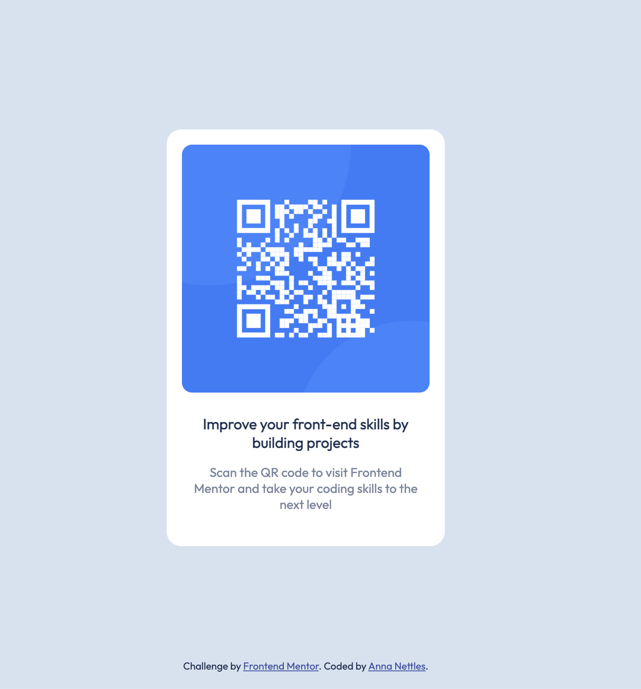

# Frontend Mentor - QR code component solution

This is a solution to the [QR code component challenge on Frontend Mentor](https://www.frontendmentor.io/challenges/qr-code-component-iux_sIO_H). Frontend Mentor challenges help you improve your coding skills by building realistic projects. 

### Screenshot

### Links

- Solution URL: [https://github.com/thecoachanna/FrontendMentor-QR-Code](https://github.com/thecoachanna/FrontendMentor-QR-Code)
- Live Site URL: [https://annas-qrcode.netlify.app/](https://annas-qrcode.netlify.app/)

### Built with

- Semantic HTML5 markup
- CSS custom properties
- Flexbox
- CSS Grid
- Mobile-first workflow

## Author

- Website - [Anna Nettles](https://anna-nettles-dev.herokuapp.com/)
- Frontend Mentor - [@thecoachanna](https://www.frontendmentor.io/profile/thecoachanna)

